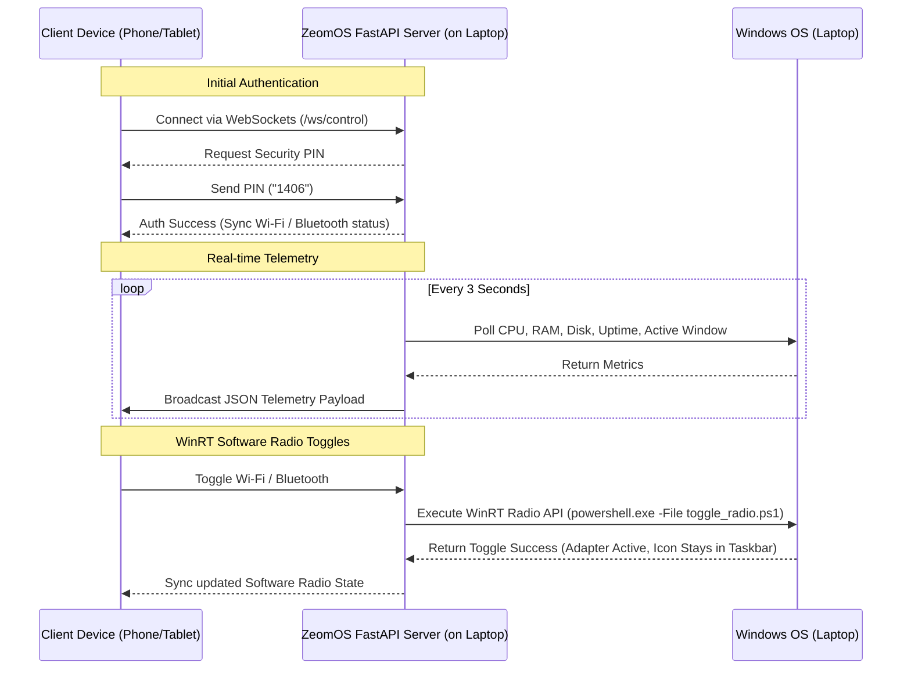

# 📈 ZeomOS - Premium Windows Remote Companion Dashboard

ZeomOS (Z-OS) is a high-fidelity, ultra-low latency, real-time desktop companion system that allows any smartphone, tablet, or secondary computer connected to the same Wi-Fi network to securely control cursor movements, simulate virtual keys, manage master system volumes, launch programs, toggle software radio adapters, and view real-time system resource diagnostics.

Designed with an elegant, satiny **Apple Music-style Glassmorphism UI** featuring fluid animated ambient gradients, saturating backdrop-blur layers, and robust light/dark mode configurations.

---

## 🎨 System Mockup & Architecture



---

## 🚀 Core Features

### 1. High-Precision Gestures Trackpad
- **Cursor Engine:** Multi-gesture active touchpad canvas managing move, tap click, double-click, and drag-and-drop.
- **Scroll & Zoom:** Integrates two-finger vertical swipe scrolling.
- **Low Latency:** Optimized to process mouse movement events over WebSockets in under 30-50ms.

### 2. Apple Music Glassmorphism UI
- **tactile Aesthetics:** Semantic light/dark modes with automatic `localStorage` persistence.
- **Saturating Backdrop Blurs:** Cards and panels utilize `backdrop-filter: blur(20px) saturate(190%)` over smooth, pulsing ambient red & grey background gradients.
- **Fluid Layouts:** Uses custom CSS grid alignments (`repeat(12, 1fr)`) that adapt smoothly from widescreen desktop monitors to touch-friendly mobile screens.

### 3. Native Hardware Radio Controls
- **WinRT Integration:** Controls your laptop's Wi-Fi and Bluetooth software radio switches natively via the Windows Runtime (`Windows.Devices.Radios`) namespace.
- **Driver Persistence:** Unlike standard scripts that disable devices in Device Manager (which makes taskbar icons disappear), ZeomOS only toggles the software switch, keeping your taskbar icons perfectly visible.

### 4. Robust Security & System Safeguards
- **Rotational Secure PIN:** Sessions require a 4-digit security PIN generated dynamically on server startup. The PIN rotates instantly when clients disconnect or refresh, preventing unauthorized hijacking.
- **30s Countdown Shutdown Guard:** Initiating a shutdown command displays a synchronous warning overlay with options to reset the timer (adds 30s) or abort the shutdown safely.

### 5. Automated connection QR Code
- Generates a local connection QR Code upon startup, allowing mobile devices on the same Wi-Fi network to scan and connect instantly.

---

## 🛠️ Technology Stack
- **Backend Core:** FastAPI (Python), Uvicorn, WebSockets
- **OS & Telemetry:** PyAutoGUI, psutil, Pillow (PIL), QRCode
- **Frontend Core:** Vanilla HTML5, CSS3, Modern JavaScript (ES6+)
- **System Integration:** PowerShell, WinRT APIs (.NET Framework)

---

## 📁 Repository Structure
```
zeomos-remote-control/
├── server.py               # Core FastAPI WebSocket dispatcher & telemetry broadcaster
├── requirements.txt        # Python dependency manifest
├── run.bat                 # One-click Windows command launcher
├── scripts/                # Dedicated PowerShell scripts
│   ├── get_radios.ps1      # WinRT software radio state reader
│   └── toggle_radio.ps1    # WinRT software radio state toggler
└── static/                 # Frontend assets (Single-Page App)
    ├── index.html          # Semantic document structure & FontAwesome linking
    ├── style.css           # Custom variables, glassmorphism, & responsive layouts
    └── app.js              # Gesture loops, Canvas streamer, & WebSocket triggers
```

---

## ⚙️ Setup & Installation

### Prerequisites
1. **OS:** Windows 10 or 11
2. **Python:** Python 3.8+ (Make sure it is added to your environment `PATH`)

### Fast Startup (One-Click)
1. Clone this repository to your computer:
   ```bash
   git clone https://github.com/yourusername/zeomos-remote-control.git
   cd zeomos-remote-control
   ```
2. Simply double-click the **`run.bat`** file. 
   - *This will automatically set up a local virtual environment (`venv`), install all required Python modules from `requirements.txt`, generate a fresh secure PIN, and launch the server.*

3. Ensure your laptop and smartphone are on the **same Wi-Fi network**.
4. Scan the QR code generated in your terminal (or navigate to the displayed `http://192.168.x.x:8000` URL).
5. Enter the secure 4-digit PIN displayed on your laptop terminal to connect!

---

## 📜 License
Distributed under the MIT License. See `LICENSE` for more information.
